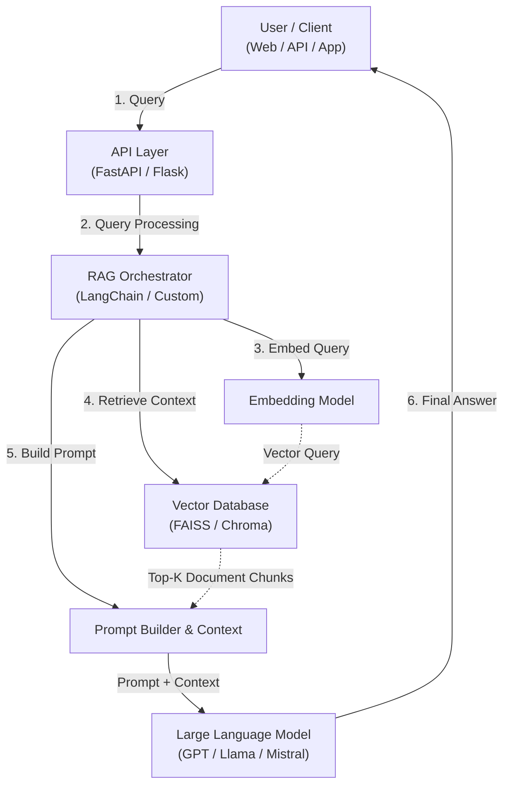
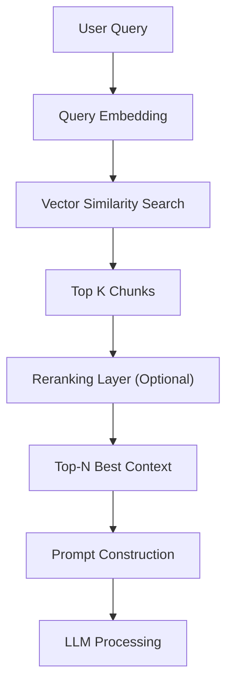
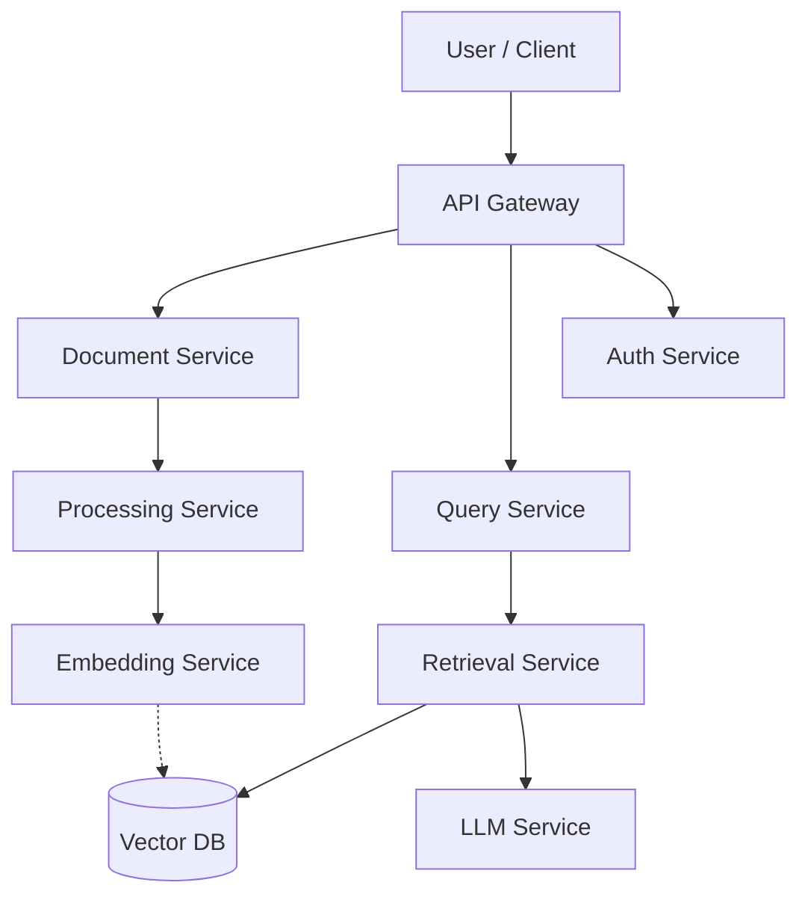
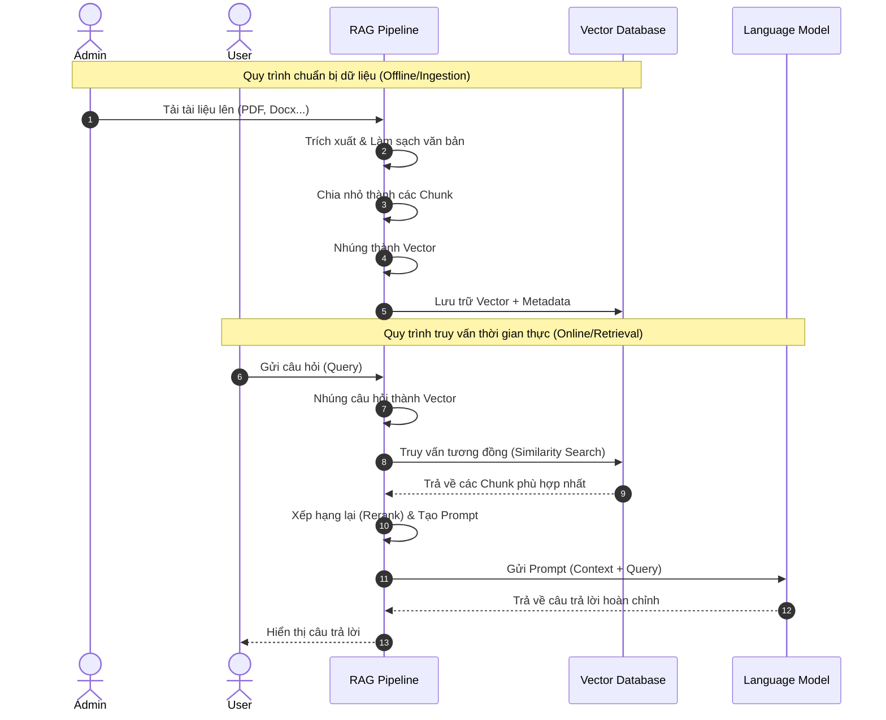

# Hệ thống RAG (Retrieval-Augmented Generation) cho Tài liệu

Chào mừng bạn đến với dự án RAG cho tài liệu AI. Dưới đây là tài liệu chi tiết về kiến trúc hệ thống, các tầng xử lý dữ liệu và cấu trúc dự án.

---

## 1️⃣ Kiến trúc tổng thể của hệ thống RAG

Hệ thống hoạt động theo mô hình truy vấn thông tin kết hợp sinh văn bản. Sơ đồ dưới đây mô tả luồng đi của dữ liệu từ người dùng đến mô hình ngôn ngữ lớn (LLM):



---

## 2️⃣ Kiến trúc chi tiết (5 Layer chính)

Một hệ thống RAG ở cấp độ production thường được chia làm 5 tầng chức năng rõ rệt:

1. **Data Ingestion Layer**: Thu thập và tải tài liệu thô.
2. **Data Processing Layer**: Làm sạch, phân đoạn (chunking) và làm giàu siêu dữ liệu (metadata).
3. **Vector Storage Layer**: Nhúng vector (embedding) và lưu trữ vào cơ sở dữ liệu vector.
4. **Retrieval & Reasoning Layer**: Tìm kiếm tương đồng, xếp hạng lại (reranking) và xây dựng prompt.
5. **Application Layer**: Gung cấp giao diện ứng dụng và API cho người dùng.

---

## 3️⃣ Layer 1 — Data Ingestion (Tải tài liệu)

**Nhiệm vụ:**
* Thu thập tài liệu từ nhiều nguồn khác nhau.
* Chuyển đổi định dạng gốc sang văn bản thô (raw text).

**Nguồn dữ liệu hỗ trợ:**
* PDF, Word, HTML, Database, CSV, Notion, Confluence, GitHub...

**Luồng xử lý (Pipeline):**
`Document` ➔ `Parser` ➔ `Raw Text`

**Công cụ phổ biến:**
* `PyMuPDF`, `Unstructured`, `Apache Tika`, `LangChain loaders`...

**Ví dụ cấu trúc module:**
```text
ingestion/
    ├── pdf_loader.py
    ├── web_scraper.py
    └── docx_loader.py
```

---

## 4️⃣ Layer 2 — Document Processing (Xử lý tài liệu)

Sau khi tải tài liệu thô, dữ liệu cần được xử lý qua các bước:

### 1. Cleaning (Làm sạch)
* Loại bỏ tiêu đề đầu/trang (headers/footers).
* Loại bỏ số trang và các ký tự nhiễu.

### 2. Chunking (Phân đoạn)
* Chia nhỏ văn bản thành các đoạn (chunks) có kích thước phù hợp để mô hình nhúng hoạt động tối ưu.
* *Ví dụ cấu hình:* `chunk_size = 500` ký tự, `overlap = 50` ký tự.

**Luồng xử lý (Pipeline):**
`Document` ➔ `Chunking` ➔ `Chunks`

### 3. Metadata Enrichment (Làm giàu Siêu dữ liệu)
* Bổ sung thông tin mô tả cho mỗi chunk để hỗ trợ lọc và tối ưu hóa kết quả tìm kiếm.
* *Các trường thông tin:* `source`, `page_number`, `title`, `author`, `timestamp`...

> [!NOTE]
> **Ví dụ về cấu trúc một Chunk sau xử lý:**
> ```json
> {
>   "text": "Nội dung chính của đoạn văn bản đã được trích xuất...",
>   "metadata": {
>     "source": "employee_handbook.pdf",
>     "page": 15,
>     "author": "HR Department"
>   }
> }
> ```

---

## 5️⃣ Layer 3 — Embedding & Vector Storage (Nhúng & Lưu trữ)

### Embedding Model
* Chuyển đổi văn bản thô (text) thành các vector số học đại diện cho ngữ nghĩa (semantic vectors).
* **Các model phổ biến:** OpenAI `text-embedding-3-small/large`, `bge-large-en`, `e5-large-v2`, `sentence-transformers`...

**Luồng xử lý (Pipeline):**
`Chunk` ➔ `Embedding Model` ➔ `Vector`

### Vector Database
* Lưu trữ các vector ngữ nghĩa nhằm tối ưu tốc độ tìm kiếm tương đồng (similarity search).

| Vector DB | Use Case phù hợp |
| :--- | :--- |
| **FAISS** | Dự án chạy local, phát triển nhanh (PoC) |
| **Chroma** | Nhẹ nhàng, dễ tích hợp cho ứng dụng nhỏ |
| **Pinecone** | Giải pháp Cloud được quản trị hoàn toàn |
| **Weaviate** | Hệ thống production cần mở rộng và hỗ trợ hybrid search |
| **Milvus** | Cơ sở dữ liệu phân tán quy mô cực lớn |

> [!NOTE]
> **Cấu trúc lưu trữ Vector DB:**
> ```json
> {
>   "id": "chunk_001",
>   "vector": [0.213, -0.845, 0.012, "..."],
>   "text": "Nội dung của chunk tương ứng",
>   "metadata": { "page": 12 }
> }
> ```

---

## 6️⃣ Layer 4 — Retrieval Pipeline (Truy xuất dữ liệu)

Khi người dùng gửi câu hỏi, luồng truy xuất sẽ hoạt động như sau:



### Kỹ thuật tìm kiếm (Retrieval Techniques)
* **Cơ bản:** Tìm kiếm tương đồng vector (Vector Similarity).
* **Nâng cao:** 
  * Tìm kiếm lai (Hybrid Search: Kết hợp BM25 + Vector).
  * Xếp hạng lại (Reranking).
  * Truy vấn đa hướng (Multi-query retrieval).
  * Viết lại câu hỏi (Query rewriting).

### Tầng Reranking (Xếp hạng lại)
Giúp lọc và lấy ra những ngữ cảnh phù hợp nhất từ danh sách tìm kiếm ban đầu:
`Top 20 documents` ➔ `Reranker Model` ➔ `Top 5 best context`
* **Models tiêu biểu:** `bge-reranker`, `cohere rerank`, `cross-encoder`.

---

## 7️⃣ Layer 5 — LLM Generation (Sinh câu trả lời)

Mô hình ngôn ngữ lớn (LLM) sẽ tiếp nhận câu hỏi cùng với phần ngữ cảnh đã được lọc.

**Cấu trúc Prompt mẫu:**
```text
Hãy trả lời câu hỏi dưới đây dựa vào phần ngữ cảnh được cung cấp. 
Nếu câu trả lời không có trong ngữ cảnh, hãy trả lời là "Tôi không biết".

Ngữ cảnh:
{retrieved_context}

Câu hỏi:
{user_query}
```

**Các LLM phổ biến:**
* `GPT-4`, `Claude 3.5 Sonnet`, `Llama 3`, `Mistral`...

---

## 8️⃣ Application Layer (Tầng ứng dụng)

Đây là giao diện tương tác cuối cùng dành cho người dùng:
* **Ứng dụng:** Web Chatbot, Slack/Discord Bot, Hệ thống API, Mobile App...
* **Công nghệ phổ biến:** `FastAPI`, `Streamlit`, `Chainlit`, `Next.js`, `React`...

---

## 9️⃣ Kiến trúc microservices (Production)

Đối với các dự án lớn, hệ thống RAG thường được thiết kế dưới dạng các microservices độc lập để dễ mở rộng và vận hành:



---

## 🔟 Cấu trúc dự án chuẩn

Thư mục dự án được tổ chức khoa học theo các module chức năng:

```text
rag-system/
├── ingestion/              # Tải tài liệu thô
│   ├── pdf_loader.py
│   └── web_loader.py
├── processing/             # Làm sạch & Phân đoạn văn bản
│   ├── chunking.py
│   └── cleaning.py
├── embedding/              # Nhúng ngữ nghĩa văn bản
│   └── embedding_model.py
├── vectorstore/            # Cơ sở dữ liệu Vector
│   └── vector_db.py
├── retrieval/              # Truy xuất & Reranking
│   ├── retriever.py
│   └── reranker.py
├── llm/                    # Kết nối với các dịch vụ LLM
│   └── llm_client.py
├── pipeline/               # Kết nối luồng RAG end-to-end
│   └── rag_pipeline.py
├── app.py                  # API ứng dụng chính (hoặc Chainlit app)
├── chainlit.md             # Tài liệu giao diện Chainlit
└── requirements.txt        # Các thư viện phụ thuộc
```

---

## 1️⃣1️⃣ Pipeline End-to-End đầy đủ

Quy trình hoạt động toàn diện của hệ thống từ giai đoạn nhập liệu đến giai đoạn phản hồi người dùng:



---

## 1️⃣2️⃣ Kiến trúc nâng cao (RAG hiện đại)

Các hệ thống tìm kiếm tiên tiến (như Perplexity, OpenAI SearchGPT) tích hợp thêm các kỹ thuật tinh vi:
* **Query Rewriting / Expansion:** Phân tích câu hỏi của người dùng và viết lại/mở rộng để tăng khả năng tìm kiếm trúng đích.
* **Multi-source Retrieval:** Tìm kiếm đồng thời trên nhiều nguồn cơ sở dữ liệu và Web Search.
* **Tool Calling / Agentic RAG:** Khả năng gọi các công cụ ngoài (như máy tính, APIs) khi cần thiết.
* **Memory & Conversation History:** Lưu trữ ngữ cảnh hội thoại để trả lời các câu hỏi liên quan trước đó.
* **Semantic Caching:** Lưu lại các câu hỏi phổ biến và câu trả lời tương ứng để giảm thời gian xử lý và chi phí API.
* **Evaluation:** Hệ thống tự động đánh giá chất lượng câu trả lời bằng các khung kiểm thử (Ragas, TruLens).